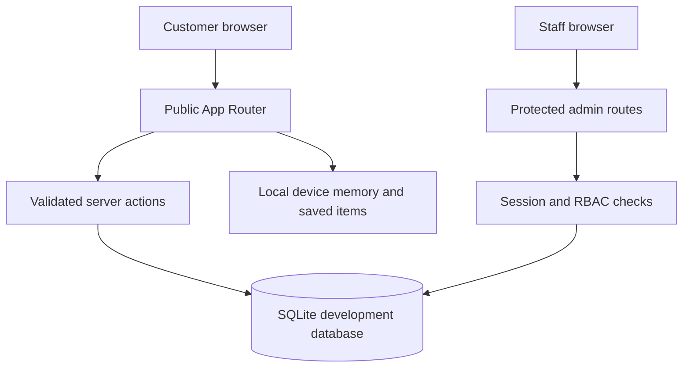
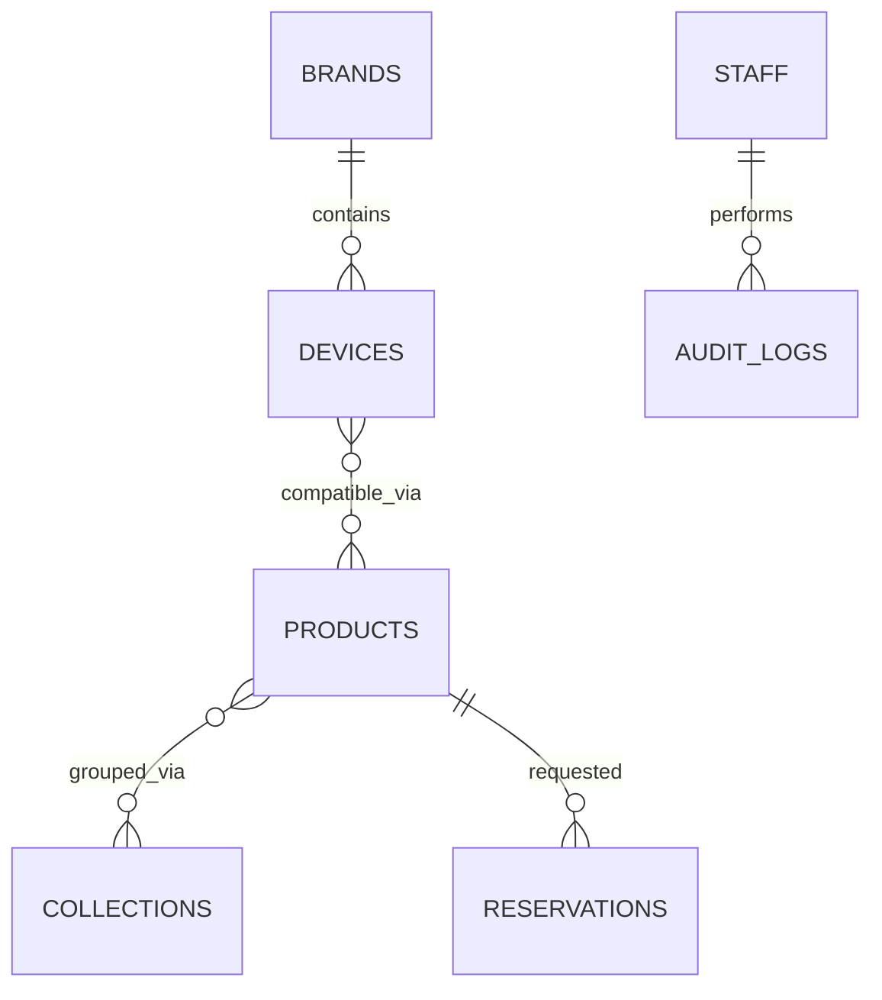

# Architecture

## System shape

The prototype is a single Next.js 16 App Router application. React Server Components read catalogue and staff data directly from a development SQLite database; interactive client components are limited to device memory, saves, recently viewed items, drawers, and message previews. Server actions validate and mutate reservations, case requests, products, compatibility, inventory, content, staff and workflow status.

## Core boundaries

| Boundary | Responsibility |
| --- | --- |
| `src/app/(store)` | Homepage, guided device selection, catalogue, collections, product detail, reservations, requests and policy pages |
| `src/app/admin` | Login, protected dashboard and operational staff areas |
| `src/components` | Shared accessible presentation and client interactions |
| `src/lib/db.ts` | Database initialization, typed queries and structured catalogue projections |
| `src/lib/auth.ts` | Eight-hour signed JWT session in an HttpOnly, SameSite cookie |
| `src/lib/permissions.ts` | Owner, manager, catalogue, support and viewer permissions |
| `database/schema.sql` | Canonical relational schema |
| `src/lib/seed-data.ts` | Repeatable fictional demo data |

## Data model

Products and phone devices have a many-to-many relationship through `product_devices`; compatibility is never inferred from product descriptions. Products and collections are linked through `product_collections`. Reservations reference a product and store the confirmed model and variant used at request time. Staff changes are written to `audit_logs`.

## Security controls in the prototype

- Passwords are bcrypt-hashed with cost 12.
- Login input is schema validated and rate limited to five attempts per email per 15-minute window.
- Sessions are signed with HS256, expire after eight hours, and use HttpOnly, SameSite=Lax, Secure-in-production cookies.
- Production refuses a missing or short `AUTH_SECRET`.
- Every admin mutation calls a server-side permission guard before changing data.
- Product and request inputs use Zod validation; SQL values are parameterized.
- Uploaded media is limited to images under 5 MB and receives a generated filename.
- Contact and WhatsApp destinations remain blank until confirmed.

## Prototype persistence

Local development uses Node's built-in SQLite driver and a real file-backed database. This is appropriate for a convincing single-instance prototype, but Node currently labels that API experimental. The current Sites Worker packaging contract is not compatible with native Next.js Node output, Node SQLite, or filesystem uploads, so the attempted private deployment has no live URL. The canonical project was intentionally not replaced with a reduced/static framework.

Production promotion should replace SQLite with managed PostgreSQL, move media to object storage, replace the in-memory login limiter with a shared rate-limit store, add backups and migrations, and integrate approved operational messaging only after client confirmation.
